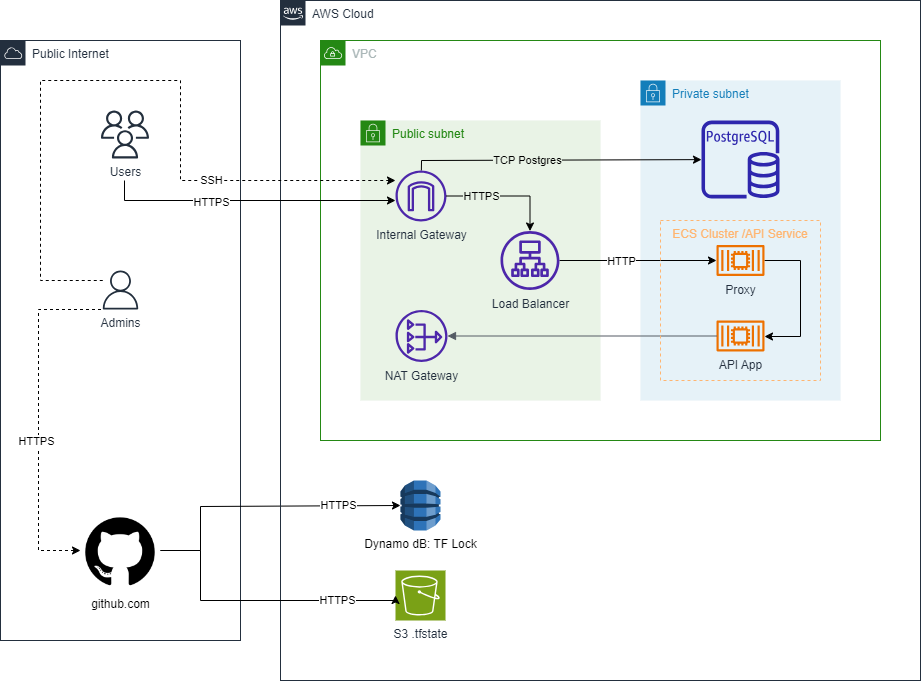

<h1 align="center">Yen's Devops Test</h1>

  
  
  

Esta aplicacion desarrolada en Python utilizando flask permite contar el número de visitantes únicos que ingresan a la pagina web. Esta información se almacena en una base de datos PostgreSQL y el provedor de nube utilizado es AWS.

## Arquitectura planteada

## Cómo inicializar el servicio

- Configuración de Jenkins: Verificar que Jenkins está instalado y en ejecución.

- Configuración de Docker: Configurar las credenciales de Jenkins para Docker Hub. Ingrese a Jenkins Dashboard > Credentials > System > Global Credentials para añadir las credenciales de Docker Hub.

- Configuración de Pipeline: Crear un nuevo Job en Jenkins.
Seleccionar "Pipeline" como tipo y enlázarlo al sistema de control de versiones (GitHub).

- Ejecutar pruebas: El pipeline ejecutará las pruebas al finalizar el stage de compilación.

## Monitoreo

1. Definir Métricas: Identificar las métricas claves, como tiempo de respuesta, tasas de error, uso de CPU, uso de memoria, etc.

2. Seleccionar Herramientas de Monitoreo: las herramientas que utilizaría en esta aplicación son:
    - Prometheus: Adecuado para recopilar métricas de servicios y aplicaciones. 
    - Grafana: Utilizado para visualización y creación de paneles.
    - AWS CloudWatch: Ofrece de monitoreo y análisis que se complementan al uso de Grafana.
    - ELK Stack (Elasticsearch, Logstash, Kibana): Para análisis de logs y monitoreo.

3. Establecer Alertas: Definir umbrales para las métricas y configurar alertas para ser notificado cuando las métricas excedan valores predefinidos.

4. Crear Paneles de Control: Construir paneles en Grafana para visualizar métricas y obtener información sobre el comportamiento de la aplicación.

Adicionalmente es posible crear scripts personalizados en AWS Cloudwatch para recopilar datos y visualizarlos en Grafana. 
Los dashboards y las alarmas serán aprovisionadas usando Terraform, para que puedan ser creados mediante templates en diferentes ambientes.

El archivo docker-compose.yml le permite crear un entorno local con la aplicación Python y una base de datos PostgreSQL . Le permite probar la aplicación y la interacción de la base de datos en un entorno local.

## Mejoras futuras

Implementar HashiCorp Vault para administrar los secretos mediante Terraform. De esta manera las conexiones a la base de datos se realizaran de manera segura

